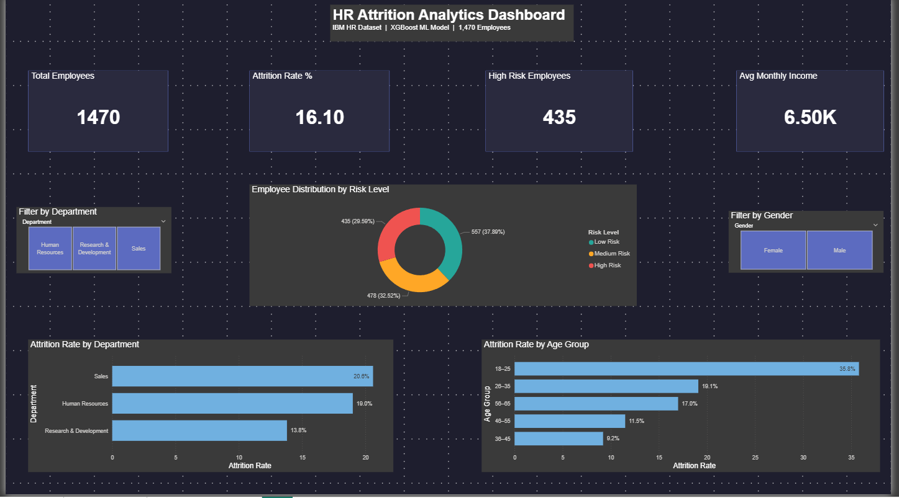
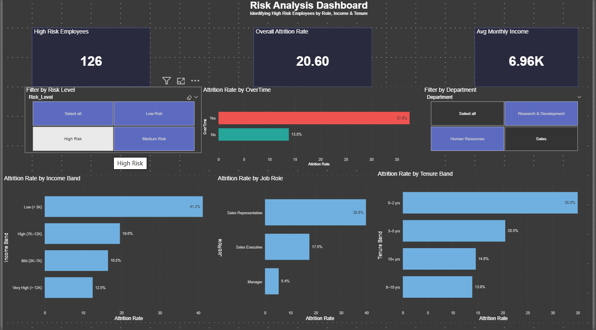
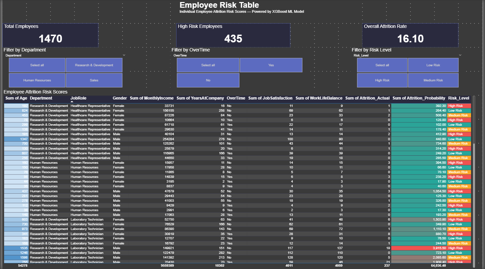

# 👥 HR Employee Attrition Analysis
### End-to-End Data Analytics & Machine Learning Portfolio Project


---

## 📌 Project Overview

Employee attrition is one of the biggest challenges faced by multinational 
companies. Losing a single employee can cost a company **6–9 months of 
that employee's salary** in recruitment, training and lost productivity.

This project builds a complete end-to-end solution to:
- Identify **which employees are most likely to leave**
- Understand **why employees leave** using SHAP explainability
- Flag **435 high-risk employees** for HR intervention
- Provide an **interactive Power BI dashboard** for HR teams

---

## 🎯 Business Problem

> *"How can HR proactively identify at-risk employees before they resign, 
> and what factors are driving attrition across the organisation?"*

---

## 📂 Project Structure
hr-attrition-analysis/
│
├── data/
│   └── processed/
│       ├── hr_cleaned.csv
│       ├── hr_for_powerbi.csv
│       ├── X_train.csv
│       └── X_test.csv
│
├── notebooks/
│   ├── 01_data_understanding.ipynb
│   ├── 02_eda.ipynb
│   ├── 03_feature_engineering.ipynb
│   └── 04_ml_models.ipynb
│
├── outputs/
│   └── figures/
│       ├── 01_attrition_overview.png
│       ├── 02_attrition_by_department.png
│       ├── 03_attrition_by_age.png
│       ├── 04_overtime_attrition.png
│       ├── 05_income_distribution.png
│       ├── 06_correlation_heatmap.png
│       ├── 07_jobrole_attrition.png
│       ├── 08_satisfaction_attrition.png
│       ├── 09_feature_correlation.png
│       ├── 10_model_comparison.png
│       ├── 11_roc_curve.png
│       ├── 12_confusion_matrix.png
│       ├── 13_shap_summary.png
│       ├── 14_shap_bar.png
│       └── 15_shap_waterfall.png
│
├── requirements.txt
└── README.md

---

## 🛠️ Tools & Technologies

| Category | Tools |
|---|---|
| Language | Python 3.11 |
| Data Analysis | pandas, numpy |
| Visualisation | matplotlib, seaborn |
| Machine Learning | scikit-learn, XGBoost |
| Explainability | SHAP |
| Class Imbalance | imbalanced-learn (SMOTE) |
| Dashboard | Power BI |
| Environment | Jupyter Notebook, VS Code |
| Version Control | Git, GitHub |

---

## 📊 Dataset

- **Source:** IBM HR Analytics Employee Attrition Dataset (Kaggle)
- **Size:** 1,470 employees × 35 features
- **Target:** Attrition (Yes/No) — 16.1% positive rate
- **Missing values:** None
- **Class imbalance:** Yes — handled using SMOTE

---

## 🔍 Project Phases

### Phase 1 — Data Understanding
- Loaded and explored 1,470 employee records
- Identified 4 zero-variance columns and dropped them
- Confirmed zero missing values
- Found 16.1% attrition rate — imbalanced dataset

### Phase 2 — Exploratory Data Analysis
- Attrition by Department, Age Group, Job Role
- Overtime vs Attrition analysis
- Monthly Income distribution
- Satisfaction scores vs Attrition
- Correlation heatmap of all features

### Phase 3 — Feature Engineering
- Label encoded 7 categorical columns
- Removed weak features (correlation < 0.05)
- Applied SMOTE to balance training data
- StandardScaler for feature normalisation
- 80/20 stratified train-test split

### Phase 4 — Machine Learning Models
- Trained Logistic Regression, Random Forest, XGBoost
- Hyperparameter tuning with GridSearchCV
- SHAP values for model explainability
- Threshold tuning to optimise Recall for business use

### Phase 5 — Power BI Dashboard
- 3-page interactive dashboard
- ML-powered risk scoring for all 1,470 employees
- Risk categorisation — High, Medium, Low
- Slicers for Department, Gender, Risk Level, OverTime

---

## 📈 Model Results

| Model | Accuracy | Precision | Recall | F1 Score | ROC-AUC |
|---|---|---|---|---|---|
| Logistic Regression | 78.2% | 36.9% | 51.1% | 42.9% | 72.9% |
| Random Forest | 81.3% | 40.5% | 36.2% | 38.2% | 73.5% |
| **XGBoost (Final)** | **68.0%** | **29.9%** | **74.5%** | **42.7%** | **77.5%** |

### Why Recall Matters More Than Accuracy Here

In HR attrition prediction:
- A **false negative** = employee leaves unprepared → high cost to company
- A **false positive** = HR checks in with a happy employee → low cost

Therefore the model is optimised for **Recall over Accuracy.**
Catching 74 out of every 100 employees who will leave is far more 
valuable than a high accuracy model that misses most leavers.

---

## 🔑 Key Findings

| Finding | Insight |
|---|---|
| Overtime | Employees working overtime are 3x more likely to leave |
| Sales Representatives | Highest attrition at 39.8% |
| Age 18–25 | Most at-risk age group at 35.8% |
| Low Income (< 3K) | Highest attrition among income bands |
| Low Job Satisfaction | Score of 1 strongly predicts attrition |
| New Employees (0–2 yrs) | Most vulnerable tenure group |

---

## 💡 Business Recommendations

1. **Review overtime policies** — single biggest driver of attrition
2. **Salary review** for employees earning under 3,000/month
3. **Retention programmes** focused on Sales Representatives
4. **Engagement surveys** for employees in first 2 years
5. **HR to prioritise** the 435 high-risk flagged employees immediately

---

## 🖥️ Power BI Dashboard

### Page 1 — Executive Overview
- KPI cards: Total Employees, Attrition Rate, High Risk Count, Avg Income
- Attrition by Department and Age Group
- Employee distribution by Risk Level

### Page 2 — Risk Analysis
- Attrition by Job Role, Overtime, Income Band, Tenure
- Slicers for Risk Level and Department

### Page 3 — Employee Risk Table
- Individual risk scores for all 1,470 employees
- Conditional formatting — Red/Amber/Green by Risk Level
- Filterable by Risk Level, Department, OverTime
## 📸 Dashboard Screenshots

### Page 1 — Executive Overview


### Page 2 — Risk Analysis


### Page 3 — Employee Risk Table

---

## ▶️ How to Run This Project

```bash
# 1. Clone the repository
git clone https://github.com/abhijithmvijayan2307-hub/hr-attrition-analysis.git

# 2. Navigate to project folder
cd hr-attrition-analysis

# 3. Create virtual environment
python -m venv venv
venv\Scripts\activate

# 4. Install dependencies
pip install -r requirements.txt

# 5. Open Jupyter notebooks in order
# Start with 01_data_understanding.ipynb
```

---

## 📬 Contact

**Abhijith M Vijayan**
- GitHub: [@abhijithmvijayan2307-hub](https://github.com/abhijithmvijayan2307-hub)

---
